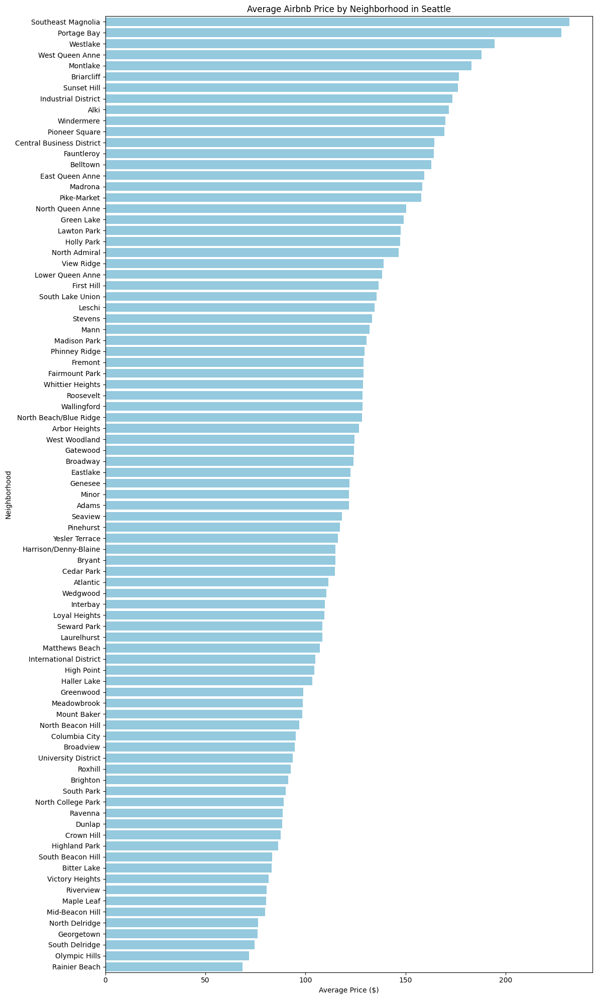
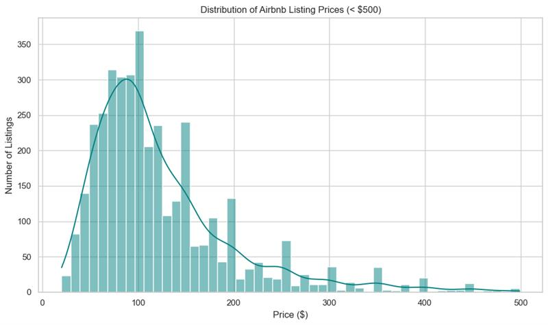
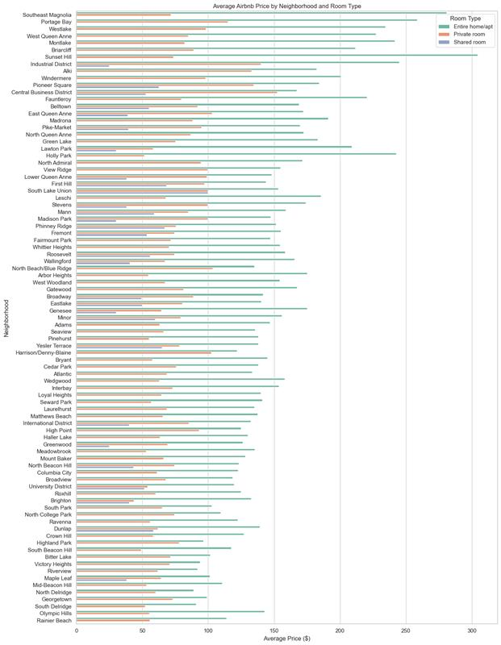
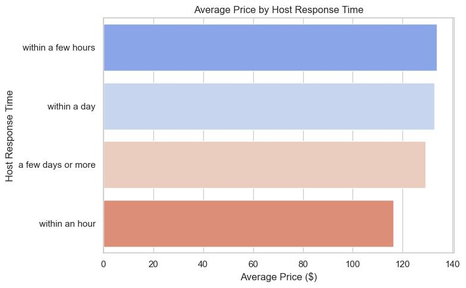
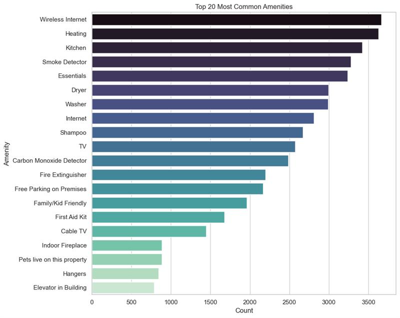

# 🏡 Seattle Airbnb Analysis: What Makes a Listing Expensive?
This project explores Airbnb listings.csv data for Seattle using Python, Pandas, and Seaborn. The analysis follows the CRISP-DM process and answers business-related questions on pricing, neighborhoods, amenities, and host behavior

## 📋 Table of Contents
- [Introduction](#introduction)
- [CRISP-DM Framework](#crisp-dm-framework)
- [Technologies Used](#Technologies Used).
- [Business Questions](#business-questions)
  - [Q1: What is the average Airbnb price by neighborhood?](#q1-what-is-the-average-airbnb-price-by-neighborhood)
  - [Q2: How do bedrooms and bathrooms affect price?](#q2-how-do-bedrooms-and-bathrooms-affect-price)
  - [Q3: Does host response time influence pricing?](#q3-does-host-response-time-influence-pricing)
  - [Q4: What are the most common amenities?](#q4-what-are-the-most-common-amenities)
  - [Q5: Do more amenities mean higher price?](#q5-do-more-amenities-mean-higher-price)
- [Conclusion](#conclusion)
- [Licensing](#licensing)
- [Authors](#authors)
- [Acknowledgements](#acknowledgements)
- 
### introduction
Airbnb has revolutionized short-term rentals around the world, and Seattle is no exception. With thousands of listings to choose from, travelers and hosts alike are curious about what drives Airbnb prices. In this project, I used real Seattle Airbnb data to uncover key patterns that influence listing prices.
This analysis was completed as part of my Udacity Data Science Nanodegree using the CRISP-DM methodology. Let’s explore what insights I discovered.

### 🧭 CRISP-DM Process
1. Business Understanding
What makes an Airbnb listing expensive? Are hosts with faster response times able to charge more? Do more amenities mean higher prices?

2. Data Understanding
I used the listings.csv dataset from the Seattle Airbnb Open Data. It includes rich details like pricing, host behavior, amenities, and location.

3. Data Preparation
I cleaned the data by:
Removing symbols like $ and , from the price column.
Filling missing values in numerical and categorical columns.
Parsing amenities into a countable format.
Dropping unnecessary or redundant columns.

4. Data Analysis & Visualization
I explored five key questions using pandas, matplotlib, and seaborn.

### Technologies Used
- Python
- Pandas, Matplotlib, Seaborn
- Jupyter Notebook

## Key Questions
- ### What is the average Airbnb price by neighborhood?
  This chart shows the average price distribution by neighborhood, helping us identify the most expensive and most affordable areas for Airbnb rentals.
  
- ### How do bedrooms and bathrooms affect price?
  This analysis explores how listing prices vary depending on the number of bedrooms and bathrooms, helping understand property size vs price.
  
- ### Does host response time influence pricing?
  This visualization investigates whether quicker response times by hosts correlate with higher Airbnb prices.
  
- ### What are the most common amenities?
  This chart identifies the most frequently available amenities in Seattle Airbnb listings, such as WiFi, kitchen, heating, etc.
  
- ### Do more amenities mean higher price?
  This analysis shows how the number of amenities in a listing affects its price, helping understand if "more features = more cost".
 

